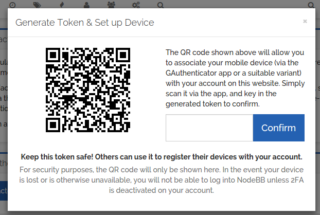
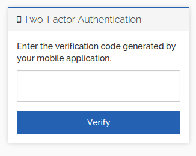

# Two-Factor Authentication for NodeBB

In addition to regular authentication via username/password or SSO, a second layer of security can be configured, permitting access only if:

* A time-based one-time password is supplied, typically generated/stored on a mobile device, or
* A hardware token is activated, such as a [Yubikey](https://www.yubico.com/) or other similar product

The Two-Factor Authentication plugin will expose this feature to end-users, allowing them to configure their
devices and enabling this enhanced security on their account.

## Version History

* v7.x
	* Logged-in users who have not passed the second-factor are now treated as guests. Prior to this, they were considered logged in, but were not able to physically navigate away from the 2FA challenge.
	* v7.0.2 to v7.2.2 (inclusive) allowed routes mounted to `/api/v3` to not be protected by this plugin. This allowed automated processes to interact via API with 2FA-protected accounts without being challenged for a second factor. As of v7.3.0, this exception was removed as best-practice for security.
* v6.x
	* NodeBB v3.x compatibility
* v5.x
    * Allows for multiple concurrent second factors (e.g. TOTP and WebAuthn).
	* The backup code is now considered a second factor, although it is still recommended to be generated when setting up TOTP/Authn
* v4.x
	* NodeBB v2.x compatibility
* v3.x
    * Introduces hardware key support via [WebAuthn](https://en.wikipedia.org/wiki/WebAuthn).
	* This version is fully backwards compatible with v2.x. The major version bump was merely due to the introduction of the new functionality

## Caveats

* Due to browser limitations, the hardware key _on mobile devices_ (especially Android devices) may not be supported. For more information on which devices are and are not supported, [please consult this chart](https://webauthn.me/browser-support)

## Installation

Install the plugin via the ACP/Plugins page.

## Screenshots

**Token Generation Step**

**Challenge Step**

## Attributions

Thanks to @yLothar and the [KEEB.it](https://keeb.it/) community for sponsoring WebAuthn and hardware key support.
